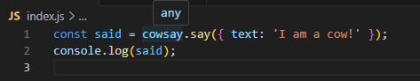
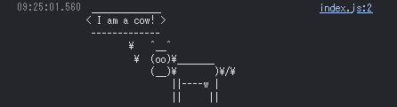
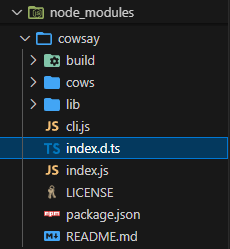
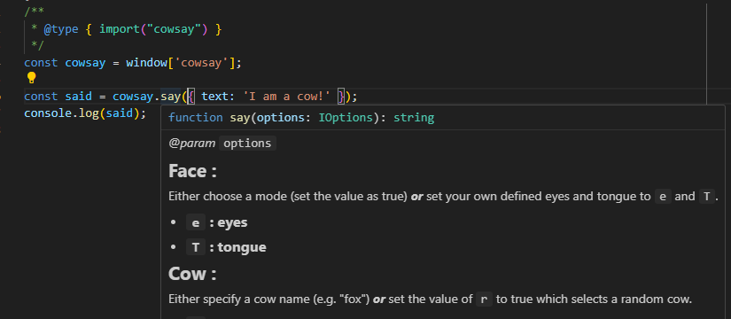
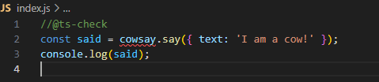
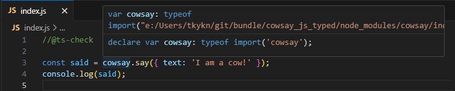

# CDNから読み込んだJSライブラリに対して、後付けで型を適用する方法

## はじめに

CDNからJSライブラリを読み込むと常に`any`型となってしまい、VSCodeのサポート(IntelliSense)を利用することができません



ところが、VSCodeは(賢いので)ヒントを与えてあげると、型を認識できるようになります

* CDNから読み込んだライブラリだけではなく、型定義のないJavaScriptの変数、関数に後付けで型を適用することができます
* (VSCodeに組み込まれている)TypeScriptの機能を利用
  * 設定ファイル(tsconfig.json)やコンパイラ(tsc)は不要です(ファイルの拡張子は.jsのままで大丈夫です)


### 最初にまとめると

* 想定する環境
  * VSCode＋JavaScriptの(npmを利用しない従来型)プロジェクト
  * CDNから読み込んだライブラリと同じライブラリがnpmに存在する(無くても自分で型定義を書くことは可能)
  * npmのパッケージに型定義ファイルが含まれている(最近は大抵含まれている)

* 型定義のやり方(下のどちらか、組み合わせて利用も可能)
  1. [JSDoc](https://www.typescriptlang.org/ja/docs/handbook/jsdoc-supported-types.html)の`@type { import("<ライブラリ名>") }`で型定義を行う
  2. `global.d.ts`ファイルを追加して、[アンビエント宣言](https://typescript-jp.gitbook.io/deep-dive/type-system/intro/d.ts)を行う


### 後付けで型定義を行うライブラリ(の紹介)

**[cowsay](https://www.npmjs.com/package/cowsay)**

cowsayとは、メッセージをつぶやくウシのアスキーアートを生成するプログラム(Unixのコマンドの1種)です
```
$ cowsay Hello!
  _______________________
 < Hello! >
  -----------------------
         \   ^__^
          \  (oo)\_______
             (__)\       )\/\
                 ||----w |
                 ||     ||
```

* JavaScriptにも移植(npm package)されており、node環境であれば下記のように簡単に利用できます

```javascript
const cowsay = require('cowsay');
console.log(cowsay.say({ text: 'Hello!' }));
```

* CDN利用の場合は下記のように利用します
```html
  <script src="//unpkg.com/cowsay@1.6.0/build/cowsay.umd.js"></script>
  <script type="text/javascript">
    const said = cowsay.say({ text: 'I am a cow!' });
    console.log(said);
  </script>
```

※cowsayにはnpmのパッケージもあり、module形式を利用すれば型定義も自動的に読み込まれます（ただし、バンドルが必要になるので、従来型アプリに組み込むのは手間がかかる）

## 手順

### cowsayをCDNから読み込んで実行する

https://www.unpkg.com/browse/cowsay@1.6.0/

* cowsayの最新版は1.6.0
* umd版を読み込みます（グローバル変数`cowsay`経由で呼び出しできる）

```html:index.html
<!doctype html>
<html lang="ja">
<head>
  <meta charset="utf-8">
  <title>cowsay</title>
</head>
<body>
  <script src="//unpkg.com/cowsay@1.6.0/build/cowsay.umd.js"></script>
  <script src="index.js"></script>
</body>
</html>
```

`cowsay`を利用するjs

```javascript:index.js
const said = cowsay.say({ text: 'I am a cow!' });
console.log(said);
```

動作確認
```
npx http-server

Available on:
  http://192.168.3.7:8080
  http://127.0.0.1:8080
  http://172.28.112.1:8080
Hit CTRL-C to stop the server
```
ブラウザのコンソールで牛がしゃべりました



## グローバル変数`cowsay`に型定義を行う

### npmから`cowsay`パッケージをインストール

型定義が欲しいので、npmで`cowsai`をインストールします

(ただし、この時点ではCDNから読み込んだグローバル変数には型定義が反映されません)

```
npm init -y
npm i npm i cowsay@1.6.0
```

型定義ファイルは `node_modules`の中にある`index.d.ts`ファイルです




次に、グローバル変数`cowsay`と、型定義の紐づけを行います(VSCodeがわかるように)

`JSDoc`の方が簡単ですがグローバル変数へ直接型定義ができません(すこし工夫が必要)。`アンビエント宣言`の方が違和感なく使えます

### グローバル変数への型定義その１：JSDoc

JavaScriptの変数と型を紐づけするために[JSDocの@typeとimport](https://www.typescriptlang.org/ja/docs/handbook/jsdoc-supported-types.html#%E3%82%A4%E3%83%B3%E3%83%9D%E3%83%BC%E3%83%88%E5%9E%8B)を利用します

残念ながらグローバル変数に型定義する構文がないため、グローバル変数から値を取り出した値に対して、型の定義を行います

```javascript:index.js
/**
 * @type { import("cowsay") }
 */
const cowsay = window['cowsay'];  // グローバル変数をローカル変数にセットすると同時に型定義を行う

const said = cowsay.say({ text: 'I am a cow!' });
console.log(said);
```

* VSCodeが型を認識するようになりました




#### 閑話休題（JavaScriptファイルで型チェックを有効にする）

jsファイルの先頭に`//@ts-check`を追加すると、TypeScriptコンパイラによる型チェックが有効になります(VSCodeの機能)

グローバル変数は未定義のためエラーになることがわかります

```javascript:index.js
//@ts-check
const said = cowsay.say({ text: 'I am a cow!' });
console.log(said);
```

`cowsay`という変数を定義なしで使っているのでエラーになってしまいます


※jsファイルが多くて、コメントを挿入するのが面倒な場合、TypeScriptを導入し(VSCodeの)型チェック機能だけを利用する方法もあります

```
npm i -D typescript
```

* tsconfig.jsonに最低限これだけ記載すれば、全.jsファイルの型チェックを行ってくれるようになります
```json:tsconfig.json
{
  "compilerOptions": {
    "allowJs": true,  // trueにすることでcheckJsを有効化できる
    "checkJs": true,　// JavaScriptファイルのエラーチェックを有効化する
  },
}
```

### グローバル変数への型定義その２：アンビエント宣言

TypeScriptの型定義方法の1つに`アンビエント宣言`がという方法があります

`アンビエント宣言`は、変数、関数が「存在する」ことを(TypeScript)コンパイラに伝える機能です。ここではグローバル変数`cowsay`がどこかに存在する(ので未定義エラーにしないでねと伝える)ことと、その型定義がどこにあるか？を記述します

[型定義ファイル (.d.ts)](https://typescriptbook.jp/reference/declaration-file#%E5%9E%8B%E5%AE%9A%E7%BE%A9%E3%83%95%E3%82%A1%E3%82%A4%E3%83%AB%E3%81%A7%E7%99%BB%E5%A0%B4%E3%81%99%E3%82%8B%E3%82%AD%E3%83%BC%E3%83%AF%E3%83%BC%E3%83%89)

[アンビエント宣言(declare)について理解する](https://qiita.com/yamatai12/items/eb271421a6c3ba367624)


本来はTypeScriptの機能ですが、VSCodeは型定義ファイル`～.d.ts`があると自動的に読み込んで型を認識してくれるのでそれを利用します

#### 型定義ファイルを作成する

`global.d.ts`ファイルを作成します(拡張子が「.d.ts」であれば、ファイル名は任意です)

```typescript:global.d.ts
// グローバル変数'cowsay'に型(.\node_modules\cowsay\index.d.ts)を適用する
declare var cowsay: typeof import('cowsay');
```

※`node_modules`から型情報を読み込むことなく自分で定義することもできます(大変ですが)


#### 動作確認

アンビエント宣言のおかげで、VSCodeが型を認識してくれるようになりました

```javascript:index.js
//@ts-check
const said = cowsay.say({ text: 'I am a cow!' });
console.log(said);
```



